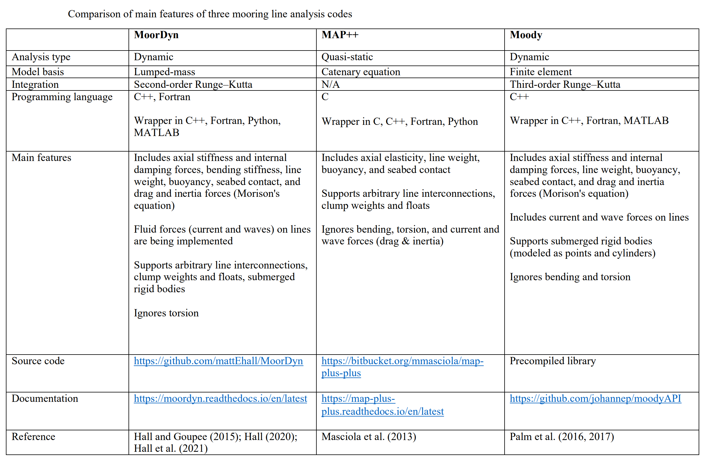

## A mooring restraints library for rigid body motions in OpenFOAM

Documentation: https://hfchen20.gitlab.io/foamMooring/

GitHub mirror: https://github.com/hfchen20/foamMooring

:star: Consider starring the repository if you find it useful. :star:

## Overview

- Works for two rigid body motion libraries `sixDoFRigidBodyMotion` and `rigidBodyMotion`.
- Mooring models of restraints include MAP++, MoorDyn, Moody, groups of linear springs.
- Most restraints support runtime generation of legacy VTK files (including vtk.series).
- You can compile only part of the library (i.e., certain restraints) if that suits your needs.
- No need to change and re-compile the built-in motion libraries and flow solvers.
- Tested on v2012, v2212, v2306, mostly with overset grid solver `overInterDyMFoam`.
- Should also work with `interFoam` (deforming mesh) and other variants `waveFoam` and `olaFlow`.
- Even `overPimpleDyMFoam` ...

{width=400px height=320px}
{width=400px height=320px}
{width=600px height=320px}

<!--  -->

## Compile foamMooring

Prerequisites: git, make, CMake, and [VTK](https://vtk.org/) if USE_VTK=ON when compiling MoorDyn v2. MAP++ may require other dependent libraries, such as `lapacke`.
- Clone the repo in `$WM_PROJECT_USER_DIR`.
```
mkdir -p $WM_PROJECT_USER_DIR 
cd $WM_PROJECT_USER_DIR
git clone https://gitlab.com/hfchen20/foamMooring.git
cd foamMooring 
```

If there is no interest in the quasi-static mooring model MAP++, specify a branch option, `-b dynamic-only`, when cloning the repo.
```
git clone -b dynamic-only https://gitlab.com/hfchen20/foamMooring.git
```

- Run `Allwmake`. Upon successful compilation, there should be at least two libraries, `libsixDoFMooring.so` and `librigidBodyMooring.so`, in `$FOAM_USER_LIBBIN`.
```
./Allwmake
```

- You can selectively compile part of the library. If there is difficulty in compiling MAP++ and map3R (quasi-static mooring code), you could skip compiling MAP++ in `Allwmake` and remove/comment out the corresponding entries in the Make files. For [files](/src/sixDoFMooringRestraints/Make/files), remove
```
map3R/mapFoamInterface.C
map3R/map3R.C
```
For [options](/src/sixDoFMooringRestraints/Make/options), remove
```
-llapacke \
-lmap-1.30.00 \
```

Actually, a new branch `dynamic-only` was created for users not interested in the quasi-static mooring model. Specify the branch name when you clone the repo in the first step above.
```
git clone -b dynamic-only https://gitlab.com/hfchen20/foamMooring.git 
```

## Code structure


## How to use (tested on v2012, v2212)

Refer to [documentation](https://hfchen20.gitlab.io/foamMooring/) for more examples.

- Prepare an OpenFOAM case as usual. The floating body motion can be accommodated by either deforming mesh `interFoam` or overset grid `overInterDyMFoam`.
- Add in `controlDict`
```
libs    (sixDoFMooring); // or (rigidBodyMooring)
```
- Prepare a mooring input file in case subfolder "Mooring". For example, for sixDoFMooring 
   - MoorDyn v1: [lines.txt](tutorial/sixDoF_2D/overset/background/Mooring) (filename hard-coded)

   - MoorDyn v2: [lines_v2.txt](tutorial/sixDoF_2D/overset/background/Mooring)

   - Moody: [boxWu_exPoint.m](tutorial/sixDoF_2D/overset/background/Mooring)

   - MAP++: [esflOWC_4lines.map](tutorial/sixDoF_2D/overset/background/Mooring)

- Define mooring restraints in `constant/dynamicMeshDict`
```
// Example mooring restraints as defined in libsixDoFMooring, add one of
//	moorDynR1 || moorDynR2 || map3R || moodyR 

moorDynR1
{
    sixDoFRigidBodyMotionRestraint moorDynR1;
}

moorDynR2_pt
{
    sixDoFRigidBodyMotionRestraint  moorDynR2;
    couplingMode       "POINT";
    inputFile          "Mooring/lines_v2_point.txt";
    refAttachmentPt
    (
        (-0.1      0.1    -0.077)
        (-0.1     -0.1    -0.077)
        ( 0.1      0.1    -0.077)
        ( 0.1     -0.1    -0.077)
    );
    writeMooringVTK    true;
    vtkPrefix         "mdv2_pt";
    vtkStartTime       0;
    outerCorrector     1;
}

moorDynR2_bd
{
    sixDoFRigidBodyMotionRestraint  moorDynR2;
    couplingMode       "BODY";
    inputFile          "Mooring/lines_v2.txt";
    writeMooringVTK    true;
    vtkPrefix          "mdv2_body";
    vtkStartTime       0;
    outerCorrector     1;
}

map3R
{
    sixDoFRigidBodyMotionRestraint map3R;
    inputFile                     "Mooring/esflOWC_4lines.map";
    summaryFile                   "Mooring/esflOWC_summary.map";
    waterDepth                    0.5;
    refAttachmentPt
    (
        (-0.1      0.1    -0.077)
        (-0.1     -0.1    -0.077)
        ( 0.1      0.1    -0.077)
        ( 0.1     -0.1    -0.077)
    );
    numberOfSegments       20;
    writeMooringVTK        true;
}

moodyR
{
    sixDoFRigidBodyMotionRestraint moodyR;
    inputFile              "Mooring/boxWu_exPoint.m";

    couplingMode           "externalPoint";  // or "externalRigidBody"
    nCouplingDof           6;
    refAttachmentPt
    (
        (-0.1      0.1    -0.077)
        (-0.1     -0.1    -0.077)
        ( 0.1      0.1    -0.077)
        ( 0.1     -0.1    -0.077)
    );
    waveKinematics         false;
    twoD                   true;
}
```

## Main features of mooring models



## Visualize mooring lines in Paraview

- Write VTK files 'mooringN.vtk' for mooring lines where N denotes a time sequence number.
- Prepare a vtk.series file 'mooring.vtk.series' to be loaded into Paraview.
- A Python script and example VTK files are provided in the tutorial to post-process MoorDyn output.
- The mooring tension could also be added to the VTK files.
- MoorDyn v2 has a built-in functionality to write XML-based VTK files.

## References

- Chen, H., & Hall, M. (2022). CFD simulation of floating body motion with mooring dynamics: Coupling MoorDyn with OpenFOAM,
Applied Ocean Research, 124, 103210. [https://doi.org/10.1016/j.apor.2022.103210](https://www.sciencedirect.com/science/article/pii/S0141118722001511)
- Chen, H., Medina, T. A., & Cercos-Pita, J. L. (2024). CFD simulation of multiple moored floating structures using OpenFOAM: An open-access mooring restraints library. Ocean Engineering, 303, 117697. [https://doi.org/10.1016/j.oceaneng.2024.117697](https://doi.org/10.1016/j.oceaneng.2024.117697) ([preprint](http://dx.doi.org/10.13140/RG.2.2.34206.10569))


## Disclaimer

This offering is not approved or endorsed by OpenCFD Limited, producer and distributor of the OpenFOAM software via www.openfoam.com, and owner of the OPENFOAM® and OpenCFD® trade marks. This offering is not approved or endorsed by any software packages mentioned above or their respective owners, and should not be considered as such.

OpenFOAM is a free, open source CFD software [released and developed by OpenCFD Ltd since 2004](http://www.openfoam.com/history/).
It has a large user base across most areas of engineering and science, from both commercial and academic organisations. [See documentation](http://www.openfoam.com/documentation)

