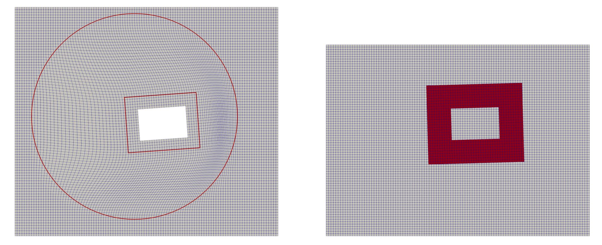
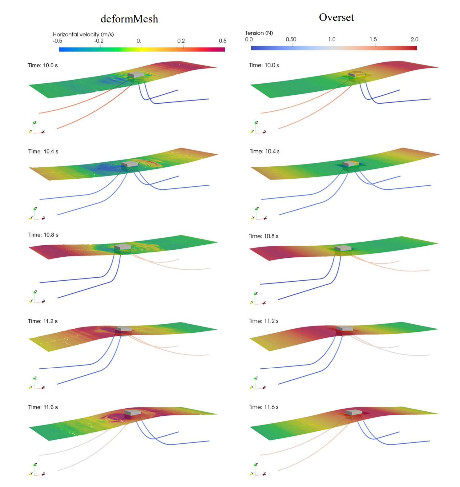

# Dynamic mesh motion

Two mesh motion methods may be applied to accommodate the floating boy motion in the CFD computational domain. The body motion may be solved by either of the two rigid body motion libraries `sixDoFRigidBodyMotion` and `rigidBodyMotion`.

Settings        | Deforming Mesh | Overset Mesh
--------------- | -------------- | ----------
flow sovler     | *interFoam*  | *overInterDyMFoam*
dynamicFvMesh   |  *dynamicMotionSolverFvMesh* | *dynamicOversetFvMesh*
**six-DoF mooring** | *sixDoFRigidBodyMotion* | *sixDoFRigidBodyMotion* 
**rgb mooring**     | *rigidBodyMotion*  | *rigidBodyMotion* |

The mesh deformation or mesh morphing technique is the classical method to accommodate body motion in the computational domain without topological changes. It is suitable for small amplitude body motions, as large motions (translation or rotation) may continuously squeeze and stretch the computational cells, resulting in deteriorated mesh quality and thus adversely affecting simulation results.

The overset mesh method is particularly suitable for applications involving large-amplitude body motions and multiple moving bodies. Two sets of grids are defined in this method: a relatively large background grid and a set of local overset grids each enclosing one of the moving bodies. A composite computational domain is then generated via cell-to-cell mappings between the two sets of disconnected grids, which overlap each other. The background grid is mostly stationary, while the overset grid moves following the body motion, prescribed in advance or calculated using the two rigid body motion libraries in OpenFOAM.

